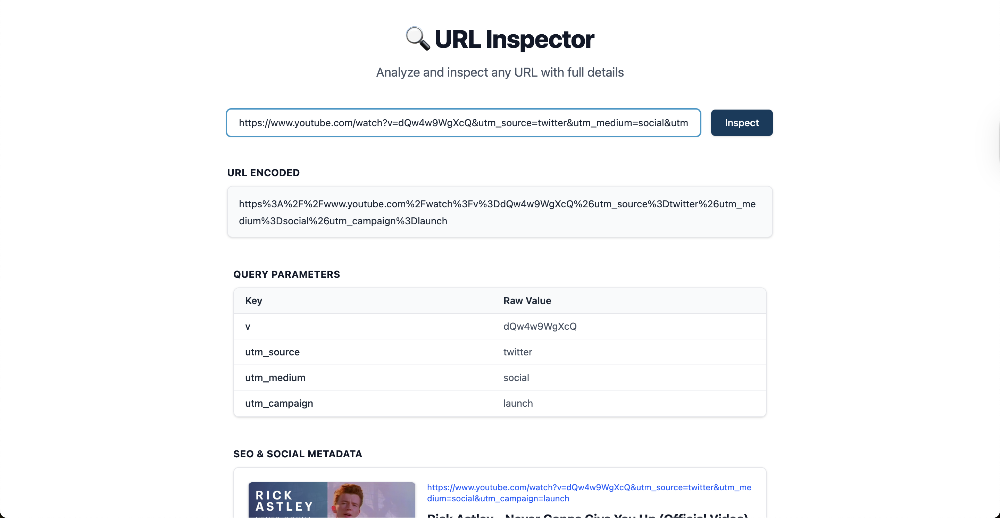

# 🔍 Link Inspector

Link Inspector is a simple and fast tool to analyze, decode, and inspect URLs and query parameters. Paste any URL and instantly see its encoded form and all query parameters, with copy-to-clipboard functionality and a clean, modern UI built with Astro and Tailwind CSS.


## 🚀 Tech Stack

- [Astro](https://astro.build/) — Static site generator
- [Tailwind CSS](https://tailwindcss.com/) — Utility-first CSS framework
- Vanilla JS (modular with ESModules)

## 📦 Project Structure

```
├── public/               # Static assets (favicon, scripts, preview images)
├── src/
│   ├── components/       # Reusable Astro components (e.g. CopyIcon)
│   ├── layouts/          # Base layout template
│   └── pages/            # Page routes (e.g. index.astro)
├── scripts/              # Public JavaScript modules
├── package.json
└── astro.config.mjs
```

## 🔧 Requirements

- **Node.js:** `^22.0.0`
- **Package Manager:** `pnpm` (recommended)

## 🧪 Local Development

```bash
pnpm install       # Install dependencies
pnpm dev           # Start local dev server (http://localhost:4321)
```

## 🏗 Build for Production

```bash
pnpm build
pnpm preview       # Preview the build locally
```

## 🌐 Deployment

You can deploy this site to any static host like:

- Vercel
- Netlify
- GitHub Pages
- Cloudflare Pages

## ✅ Features

- 🔐 Encodes/decodes full URLs
- 📊 Lists all query parameters
- 📋 One-click copy for values
- 🧼 Clean and responsive UI
- ⚡ Fast static build with Astro

## 📝 TODO

- [x] Encode and decode URL
- [x] Display query parameters
- [x] Copy to clipboard button
- [ ] Add "Copied!" tooltip
- [ ] Support dark mode
- [ ] Save recent URLs
- [ ] Make shareable link
